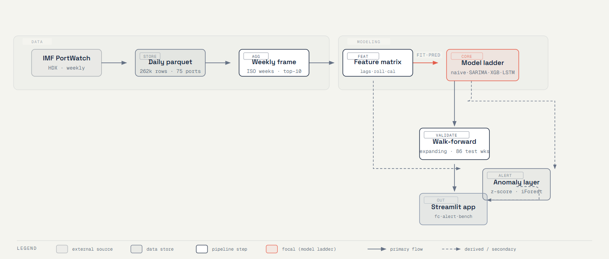
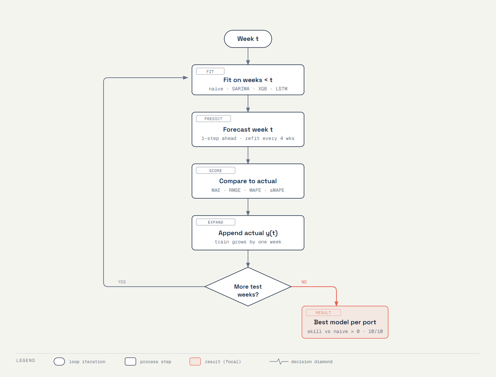
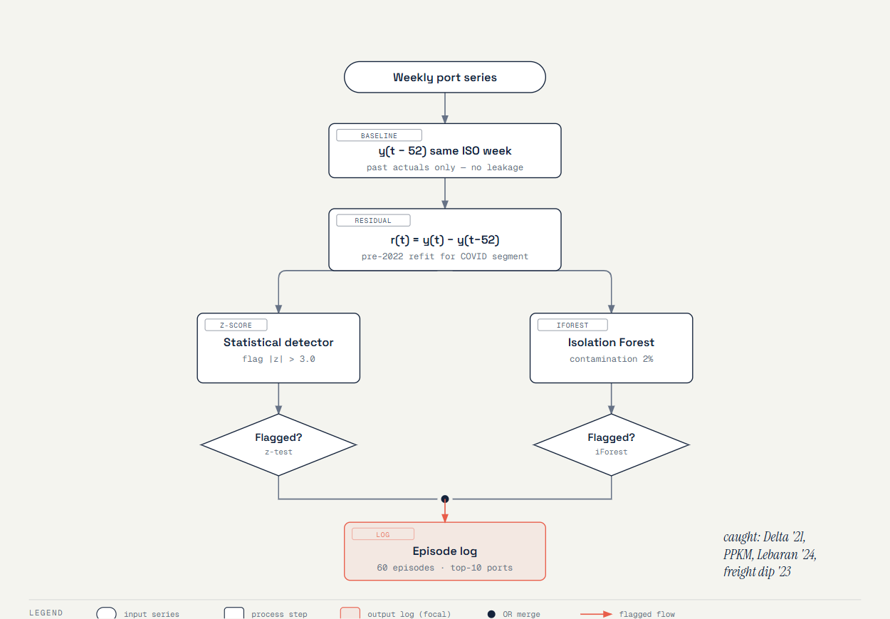

# 🚢 ContainerPort-ID

**Weekly container-activity forecasting & early warning across Indonesia's top-10 container ports.**

Flagship data-science portfolio project (targeting maritime-logistics roles — Pelindo, Samudera Indonesia, terminal operators). It answers three operator questions from public data:

1. **How many container vessels will call next week?** (berth & crane planning)
2. **How much import/export tonnage will flow?** (yard & labour planning)
3. **Is activity deviating abnormally?** (disruption early warning)

## Results (walk-forward, 2025+ test window, 86 weeks)

| Port | Best model | sMAPE | Skill vs naive |
|---|---|---|---|
| Tanjung Priok | LSTM | 6.6% | +16% |
| Surabaya | LSTM | 8.5% | +30% |
| Gresik | LSTM | 11.1% | +31% |
| Makassar | LSTM | 15.5% | +20% |
| Belawan | LSTM | 22.6% | +39% |
| Bitung | LSTM | 27.8% | +27% |
| Teluk Bayur | SARIMA | 32.6% | +17% |
| Kendari | LSTM | 36.8% | +54% |
| Manokwari Road | XGBoost | 40.7% | +8% |
| Donggala | XGBoost | 42.9% | +7% |

**Every port (10/10) has a model that beats the seasonal-naive baseline.** The honest model ladder — naive → SARIMA → XGBoost → LSTM — is evaluated identically under expanding-window walk-forward validation (1-week horizon, refit every 4 weeks; SARIMA every 26).

The anomaly layer (z-score + Isolation Forest on y(t) − y(t−52) residuals, COVID-era baseline re-fit per spec) catches documented events:
- **2020-W22 spike** (Priok/Surabaya): post-lockdown rebound vs 2019 baseline
- **2021-05 / 2021-09 drops** (Priok): Delta wave, PPKM Level 4
- **2023 drops** (Teluk Bayur, Makassar): global freight recession
- **2024-W15 multi-port drop**: Lebaran shutdown (10 Apr 2024)

### How it works







Interactive sources live in `reports/figures/diagrams/*.html` (self-contained HTML/SVG).

## Data

**IMF PortWatch** daily port activity & shipment estimates, Indonesia, via [HDX](https://data.humdata.org/dataset/2c0f31be-3561-41c8-acce-b868ef40c868) — public/open data, updated weekly.
- 75 ports × 2019-01-01 → 2026-08-28 (262k daily rows)
- Top-10 container ports modeled: Priok (35.5% of national container calls), Surabaya (22.5%), Gresik (14.3%), + 7 feeders
- 28 of 75 ports never see a container vessel (bulk/oil only) — excluded from container modeling
- Tonnage figures are AIS-derived **estimates** — framed as such everywhere

## Repo layout

```
├── data/raw/                  # parquet source (gitignored — refresh via README)
├── data/processed/            # weekly frames, forecasts, projections (gitignored)
├── notebooks/01–04            # EDA → features → forecasting → anomaly (executed, with outputs)
├── src/
│   ├── data.py                # load, clean, daily→weekly ISO aggregation
│   ├── features.py            # lags 1–8w, rolling 4/8/12w, Ramadan/Lebaran calendar
│   ├── models.py              # NaiveSeasonal, SARIMA, XGBoost, LSTM (common interface)
│   ├── evaluate.py            # walk-forward, MAE/RMSE/MAPE/sMAPE, skill vs naive
│   └── anomaly.py             # residual z-score, IsolationForest, episode log
├── app/dashboard.py           # Streamlit: forecast, anomalies, benchmark
├── reports/                   # anomaly_log.csv, case_study.md, figures/
├── run_forecasting.py         # full driver (~9 min CPU)
├── make_notebooks.py          # regenerates + executes notebooks
└── tests/test_pipeline.py     # invariants: aggregation, lag alignment, ISO weeks, no-leakage
```

## Reproduce

```bash
pip install -r requirements.txt
# data: download the Indonesia CSV from the HDX link above, then:
python -c "import pandas as pd; pd.read_csv('<downloaded.csv>').to_parquet('data/raw/portwatch_indonesia_daily.parquet')"
python src/data.py            # build weekly top-10 frame
python run_forecasting.py     # walk-forward eval + 8-week projections (~9 min)
python make_notebooks.py      # regenerate notebooks with outputs
streamlit run app/dashboard.py
pytest tests/                 # 8/8 invariants
```

## Method notes & limitations

- **Granularity:** weekly (daily kept for EDA context). Weekly aggregation smooths AIS noise and matches planning cadence.
- **No leakage:** walk-forward expands strictly on past actuals; features use only lagged values (`shift(1)` before rolling windows); asserted in tests.
- **Calendar features:** week-of-year sin/cos, month, Ramadan window + Lebaran week (Kemenag dates 2019–2026, hardcoded with source).
- **Honest ladder:** LSTM wins on 8/10 ports but the gap vs XGBoost is small; SARIMA competitive on some (Teluk Bayur best). On near-zero-activity feeder weeks MAPE explodes, so sMAPE is the headline metric for small ports.
- **Tonnage units** are estimates from vessel drafts/AIS (not customs figures) — directional signal only.
- **Projections** (8-week) come from best-model-per-port fit on all data; ISO week-53 arithmetic is approximate (noted in driver).
- Out of scope: per-vessel ETA, AIS trajectory modeling, realtime ingestion (weekly manual refresh).
